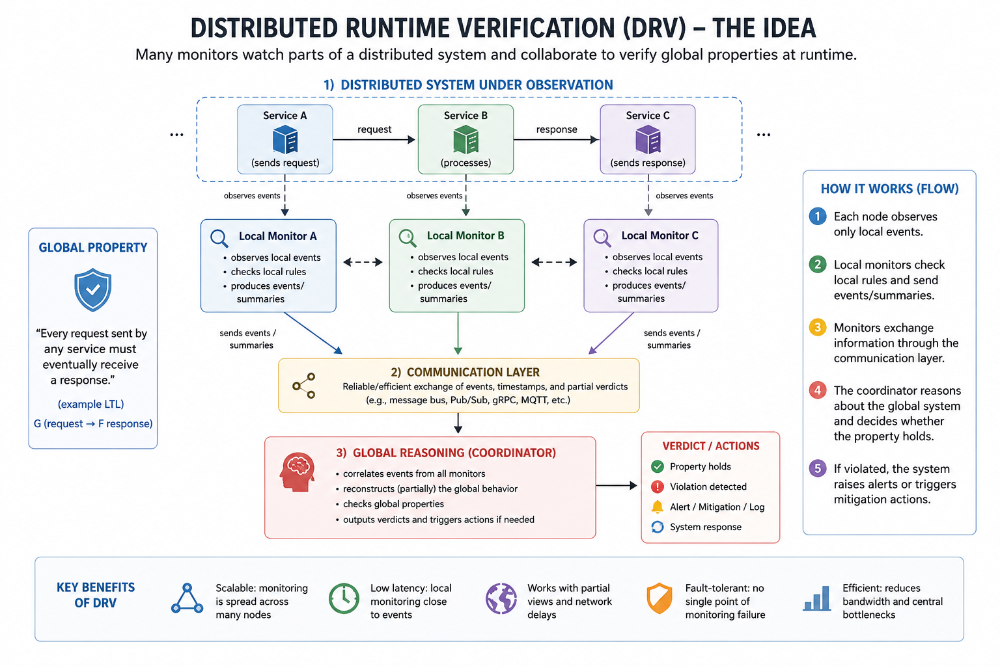

# ironixir
BEAM-based IoT management software

The project idea centers around building a distributed IoT management, orchestration, monitoring, and security platform using the Erlang/Elixir ecosystem as the foundational runtime architecture. The platform would combine embedded runtimes, distributed supervision, realtime analytics, and fault-tolerant cloud orchestration into a unified system capable of managing large fleets of microcontrollers, edge devices, and industrial embedded systems. The architecture would leverage the unique strengths of the BEAM virtual machine and related technologies to create a resilient, highly concurrent, and security-focused IoT infrastructure.

At the core of the platform is the idea that every device in the network can be represented as a supervised distributed actor. Rather than treating embedded devices as isolated firmware targets, the system treats them as participants in a larger distributed runtime. This approach fundamentally changes how IoT infrastructure is managed. Instead of relying on fragile polling systems, static dashboards, or centralized monolithic control architectures, the system would use lightweight concurrent processes and distributed messaging to continuously supervise device behavior, enforce operational policies, and respond to anomalies in realtime.

The architecture would primarily revolve around several major technologies within the Erlang and Elixir ecosystem:

* [AtomVM](https://atomvm.org)
* [Nerves Project](https://nerves-project.org)
* [Phoenix Framework](https://www.phoenixframework.org)
* [Phoenix LiveView](https://hexdocs.pm/phoenix_live_view/Phoenix.LiveView.html)
* [Livebook](https://livebook.dev)

The embedded layer of the system would rely heavily on AtomVM. AtomVM is a lightweight implementation of the Erlang virtual machine designed specifically for microcontrollers and constrained devices such as ESP32-class systems. By allowing Erlang or Elixir-style concurrency and messaging semantics to run directly on embedded hardware, AtomVM introduces a fundamentally different programming model into the IoT world. Instead of building firmware entirely around procedural loops, interrupts, and state machines, developers can structure firmware as collections of isolated processes supervised through actor-based concurrency.

This creates several advantages. Embedded applications can isolate faults more effectively, recover from failures without rebooting the entire device, and communicate through asynchronous messaging rather than tightly coupled procedural control flow. The result is firmware that behaves more like a resilient distributed system than a traditional microcontroller application.

The platform’s architecture would likely separate devices into multiple layers:

1. MCU Layer
2. Edge Gateway Layer
3. Cloud Orchestration Layer

The MCU layer would consist of constrained embedded devices running AtomVM. These devices would execute local sensor acquisition, actuator control, protocol handling, and lightweight behavioral validation. AtomVM-enabled devices could expose telemetry, health states, watchdog data, cryptographic attestations, and operational metrics to higher-level supervisory systems.

The edge gateway layer would primarily use Nerves. Nerves is an embedded Linux platform for Elixir systems designed for hardware-focused deployments. Nerves devices could serve as local orchestration gateways, protocol translators, secure update coordinators, and distributed supervisory nodes between the embedded fleet and centralized cloud infrastructure.

Nerves gateways would be particularly important because most IoT systems cannot rely entirely on microcontrollers alone. Many industrial systems require local coordination, intermittent offline operation, and higher-compute edge analytics. Nerves devices could aggregate telemetry from hundreds or thousands of AtomVM-enabled MCUs while maintaining local autonomy during cloud outages or network failures.

These edge gateways could also handle:

* secure OTA deployments
* certificate management
* fleet synchronization
* local anomaly detection
* protocol bridging
* encrypted telemetry forwarding
* distributed policy enforcement
* edge caching
* realtime coordination logic

The cloud orchestration layer would likely be built using Phoenix and Phoenix LiveView. Phoenix provides a highly concurrent web framework optimized for realtime systems. LiveView extends this model further by enabling server-rendered realtime interfaces with minimal frontend complexity.

This is particularly important for IoT management systems because realtime operational visibility is central to maintaining large fleets of devices. Traditional IoT dashboards often rely on polling, REST-heavy architectures, or complex frontend frameworks. LiveView allows the entire operational dashboard to behave as a live distributed control surface synchronized directly with backend processes.

The platform could provide:

* fleet health dashboards
* realtime device supervision
* telemetry visualization
* anomaly alerts
* device state transitions
* distributed logs
* security incident views
* topology maps
* policy enforcement interfaces
* firmware rollout management
* operational command consoles

Since LiveView maintains persistent websocket sessions tied directly to backend state, device state changes could propagate instantly across operational dashboards without requiring extensive frontend synchronization logic.

One of the most significant technical ideas behind the platform is the concept of “controllers managing MCUs ensuring that the MCUs are behaving correctly.” This moves the system beyond simple IoT device management into the realm of distributed runtime verification and embedded security orchestration.

In this architecture, supervisory controllers would continuously validate device behavior against expected operational baselines. Every device could maintain a behavioral profile describing normal operating characteristics such as:

* sensor update frequency
* network communication patterns
* memory utilization
* CPU activity
* GPIO activity
* timing characteristics
* actuator states
* protocol compliance
* firmware integrity
* power consumption profiles

The supervisory system could then detect deviations from expected behavior. This effectively transforms the IoT platform into a distributed embedded detection and response system.

Potential capabilities include:

* firmware integrity validation
* runtime behavioral attestation
* watchdog orchestration
* anomaly detection
* sensor sanity validation
* policy enforcement
* secure configuration validation
* cryptographic identity verification
* malicious firmware detection
* compromised node isolation
* distributed incident correlation
* edge intrusion detection
* realtime threat scoring

This type of architecture is particularly important in industrial and cyber-physical systems where device compromise may have physical consequences. Unlike traditional endpoint detection systems focused on desktops or servers, embedded systems often lack sophisticated runtime supervision. The proposed architecture introduces distributed resilience and monitoring directly into the embedded runtime model.

The BEAM runtime is particularly well-suited for this style of architecture because its concurrency model naturally maps to distributed device supervision. Every device, subsystem, protocol handler, and telemetry stream can be represented as isolated lightweight processes. OTP supervision trees allow the system to recover from failures in a structured and deterministic manner.

For example:

* each MCU could map to a process
* each sensor could map to a child process
* each gateway could operate as a supervisor
* each telemetry stream could function as an independent actor
* policy engines could supervise operational constraints
* security modules could monitor runtime behavior
* OTA systems could coordinate deployments through distributed supervisors

This actor-oriented structure provides strong fault isolation. A failing subsystem can restart independently without bringing down the rest of the platform.

The system would also benefit heavily from Erlang’s distributed systems heritage. Erlang was originally designed for highly available telecommunications infrastructure where uptime, concurrency, and fault recovery were critical. These same properties are highly desirable in IoT and industrial systems where device fleets may contain millions of endpoints operating continuously in hostile environments.

Another important component of the architecture is Livebook. Livebook introduces interactive notebook-style workflows into the operational infrastructure. Rather than limiting operational analytics to static dashboards, engineers and analysts could execute interactive workflows directly against live fleet telemetry.

This creates possibilities for:

* collaborative incident response
* fleet-wide diagnostics
* operational analytics
* anomaly investigation
* telemetry exploration
* embedded machine learning workflows
* security analysis
* distributed debugging
* forensic analysis
* realtime experimentation

Livebook could also integrate with Nx and Axon for machine learning workflows. This enables lightweight anomaly detection and behavioral modeling directly within the operational environment. Analysts could train behavioral models using historical telemetry and deploy them into edge gateways or supervisory systems for realtime inference.

The platform’s communication architecture would likely combine several distributed messaging systems depending on deployment requirements:

* MQTT
* NATS
* gRPC
* Phoenix PubSub
* WebSockets
* distributed Erlang messaging

The use of asynchronous event-driven communication would allow the system to scale naturally across geographically distributed fleets while tolerating intermittent connectivity and partial network failures.

A particularly powerful aspect of the architecture is the unification of embedded runtimes and cloud orchestration under a single concurrency model. Traditional IoT systems often combine multiple unrelated stacks:

* C firmware
* Python orchestration
* JavaScript dashboards
* SQL analytics
* separate monitoring infrastructure

This fragmentation introduces complexity, inconsistent concurrency semantics, and operational brittleness.

In contrast, the proposed architecture could unify:

* embedded logic
* edge orchestration
* distributed messaging
* operational dashboards
* analytics
* security monitoring

under a largely consistent actor-oriented runtime philosophy.

The architecture also naturally supports horizontal scaling. BEAM systems are specifically designed to handle extremely large numbers of concurrent lightweight processes. This makes the system suitable for large-scale distributed fleets where millions of devices may continuously stream telemetry and operational state.

Because supervision and messaging are built directly into the runtime itself, many operational concerns become architectural primitives rather than external infrastructure layers. Failure recovery, process isolation, distributed messaging, and state coordination are inherent parts of the system design.

The resulting platform represents a convergence of:

* distributed systems engineering
* embedded runtime orchestration
* cyber-physical security
* edge computing
* realtime analytics
* distributed supervision
* operational intelligence
* actor-based concurrency

Rather than treating IoT devices as isolated endpoints, the system treats them as supervised distributed participants within a resilient runtime ecosystem. This transforms IoT infrastructure from static device management into an active, self-monitoring, behaviorally aware distributed system capable of realtime orchestration, anomaly detection, and operational resilience across embedded fleets.

